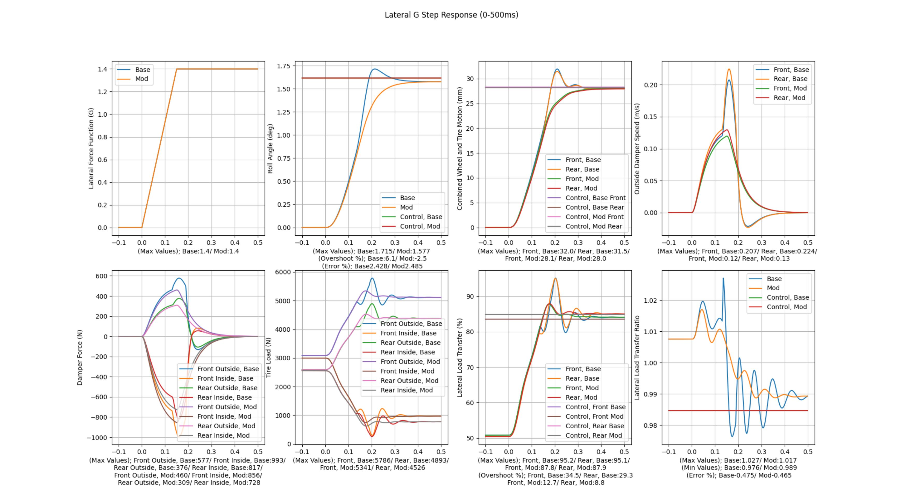
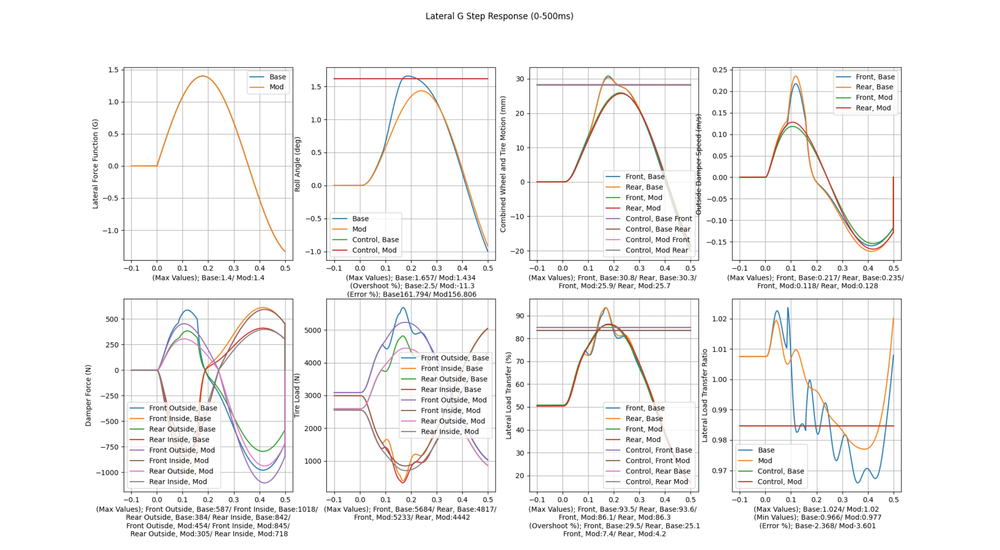
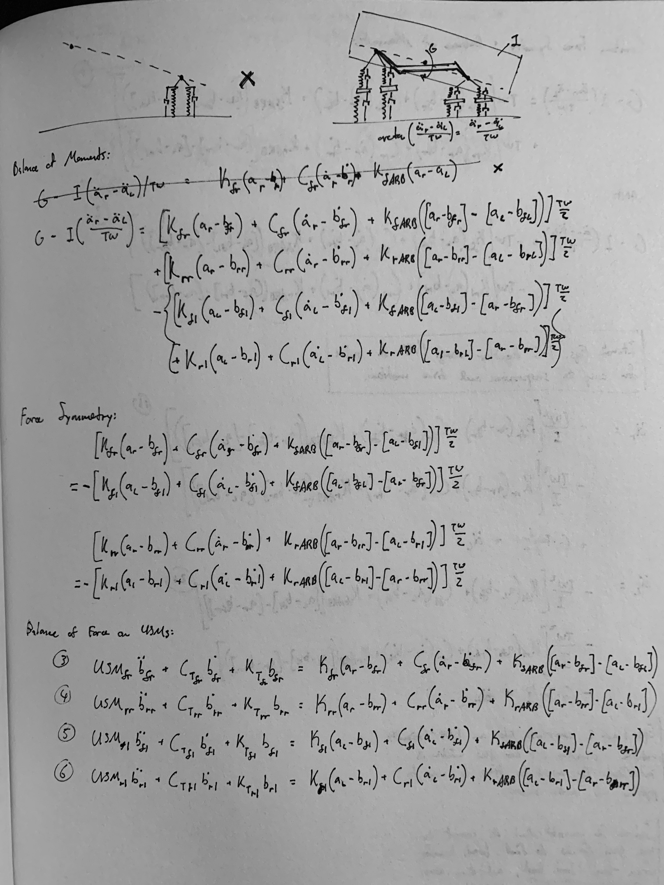
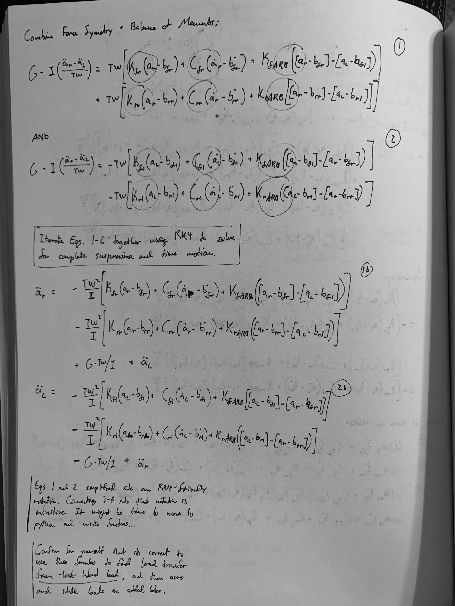

# Roll.Sim
Hello! Thank you for visiting Roll.Sim, a chassis response simulator solving with multi-body physics and 4th-order Runge-Kutta methods. Roll.Sim is designed to be more lightweight and inexpensive than professional chassis simulation software, while still being far more detailed and descriptive than traditional grassroots motorsports tuning tools.

## Safety
For your own safety, DO NOT use Roll.Sim code on real-world vehicles as it is still highly experimental. Please read the complete in-program safety warning before using Roll.Sim.

## Sample Outputs and Usage
Use Roll.Sim to study the effects of changing spring, damper, mass, geometry, and many other variables on a simulated vehicle model in time-varying pure lateral acceleration. Tire loads, damper force, roll angle, and many more variables are given as a function of time. Horizontal lines represent the steady-state solution at the peak G-force. In the below examples, the mod configuration uses slightly higher damper rebound rates than the base configuration. This is enough to prevent the dampers entering their high-speed domain, keeping tire load variation and lateral load transfer lower and more consistent.

Fig 1. 0.15s step response to 1.4G.

Fig 2. Sin response.

## Areas of Active Development
1. Func_time_response_6.py, containing the function RSF_transient_response_6(): This is the latest version of the transient roll response calculator, the heart of Roll.Sim. The updated vehicle model represents a step-change in accuracy over version 5, allowing for asymmetric roll brought on by different bound/rebound damper rates on the outside/inside wheels, respectively. DOFs increase from 3 to 6. This function will also include functionality to decompose weight transfer by components (sprung/unsprung geometric, springs, anti-roll bars, dampers, etc). This file is under construction and in the repository, but currently not referenced in Roll.Sim_v0.2.0.py. For more information on the new vehicle model, view RollSim_vehicle_model_a.jpg and RollSim_vehicle_model_b.jpg. The notation is as follows: "a" and "b" variables describe chassis displacement and tire displacement, respectively. "I" represents rotational inertia about the roll axis, "USM" variables represent unsprung masses. "K" and "C" variables represent spring and damper rates, respectively. Equations 1b, 2b, and 3-6 compose the complete set of differential equations to be solved using RK4, from which time-dependent tire loads can be explicitly derived.

2. Testing: A basic pytest suite should cover invalid arguments, metric/imperial conversions, etc.
3. General cleanup: includes import statement cleanup, resolving old comments, unifying naming conventions, etc.
